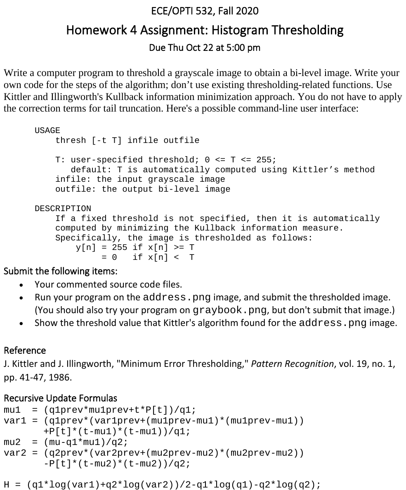
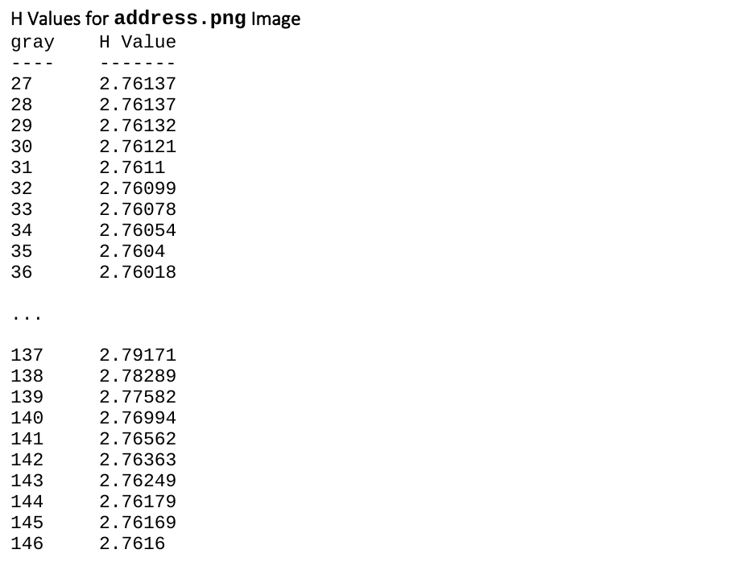

### ECE 532 HW4: Histogram Thresholding
## Requirements
This program was built on Ubuntu 20.04 using GNU Makefile.

## How to Build and Run
To build and run the program simply invoke

```bash
$ make run
```

To automatically compile a submission folder, invoke:
```bash
$ make submission
```

## Project Details



---


